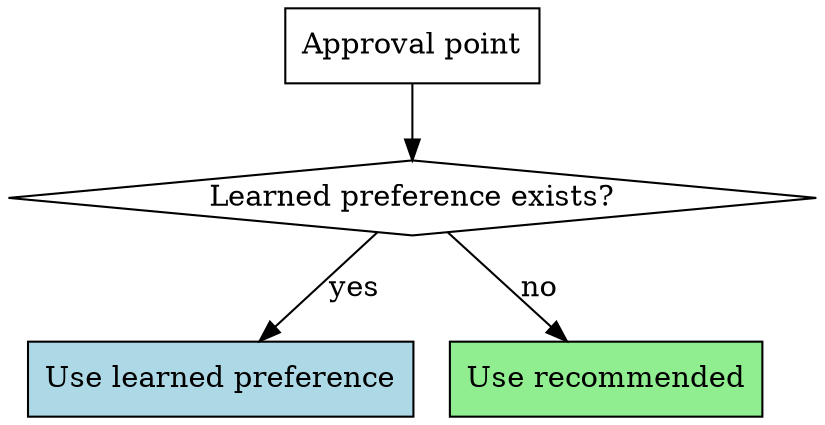
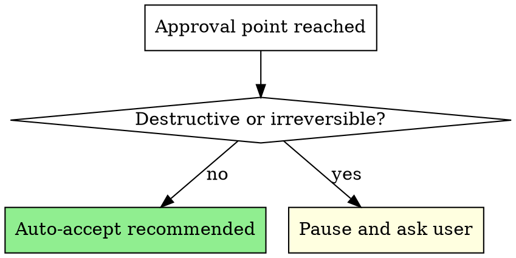

# Autopilot

## Overview

Auto-accept all recommended options from superpowers skills without pausing for user approval. Invoke at session start for a hands-off workflow.

## When Active

When this skill is invoked, you MUST automatically proceed with the recommended option at every approval/choice point in superpowers skills. Do NOT pause to ask the user. Do NOT present options and wait. Just take the recommended path and keep moving.

## Learning — Adaptive Preferences

Autopilot learns from the user's choices over time. Preferences are stored in `~/.claude/skills/autopilot/preferences.md`.

### When to Record

Record a preference whenever the user **manually chooses** an option — whether autopilot is on or off:

- User picks a non-recommended approach in brainstorming → record it
- User always chooses "PR" over "merge" at finishing-branch → record it
- User approves pushes to feature branches but rejects pushes to main → record it
- User says "continue" at a batch checkpoint vs "stop and review" → record it
- User overrides an auto-accept decision → record the override

### How to Record

After the user makes a choice at any approval point, append to `preferences.md`:

```markdown
## [Skill Name] — [Approval Point]
- User chose: [what they chose]
- Over: [what was recommended or other options]
- Context: [brief context — project type, branch, etc.]
- Count: [increment if same pattern seen before]
```

**Consolidate over time.** If you see the same pattern 3+ times, summarize it as a rule:
```markdown
## Learned Rules
- finishing-branch: User always picks "Push and create PR" (seen 5x)
- writing-plans: User always picks "subagent-driven" (seen 3x)
- brainstorming: User prefers simplest approach over recommended when both are viable (seen 4x)
```

### How to Use

When autopilot is ON and an approval point is reached:

1. **Check preferences.md first** — if there's a learned rule for this situation, follow it
2. **Fall back to recommended** — if no learned preference, pick the recommended option
3. **Announce the source** — "Going with PR (your usual preference)" or "Going with approach 2 (recommended, no prior preference)"



### When Autopilot is OFF

Still record choices to `preferences.md` — learning happens regardless of mode. This way, the next time autopilot is turned on, it has your latest preferences.

## Auto-Accept Rules

At these approval points, proceed immediately without asking:

| Skill | Approval Point | Auto Action |
|-------|---------------|-------------|
| brainstorming | 2-3 approach options | Pick recommended approach, state which you chose |
| brainstorming | Design section approval | Approve each section, continue to next |
| brainstorming | Final design approval | Approve and proceed to writing-plans |
| writing-plans | Execution method choice | Pick recommended method, state which you chose |
| executing-plans | Batch checkpoint | Continue to next batch |
| systematic-debugging | Phase transitions | Proceed through all phases |
| Any skill | "Recommend X" | Do X |

**Announce, don't ask.** Instead of "Which approach do you prefer?", say "Going with approach 2 (recommended) — [one-line reason]" and continue.

## HARD STOP — Pause for These

Do NOT auto-accept destructive or irreversible actions. Present options as normal and wait for user input:

- `git push` to any remote branch
- `git merge` to any branch
- `git reset --hard`, `git checkout .`, or any force operation
- "Discard this work" option in finishing-a-development-branch
- Deleting branches, files, or significant code
- Any action that affects shared/remote state



## Red Flags — These Mean STOP

If you catch yourself thinking any of these, you are about to auto-accept something you should NOT:

| Thought | Action |
|---------|--------|
| "It's just a push to my branch" | STOP. All pushes need approval. |
| "Merging to main is the obvious choice" | STOP. All merges need approval. |
| "Discarding saves time" | STOP. Destructive. Ask first. |
| "Force push will fix it" | STOP. Irreversible. Ask first. |
| "I'll just delete this old branch" | STOP. Deletion needs approval. |
