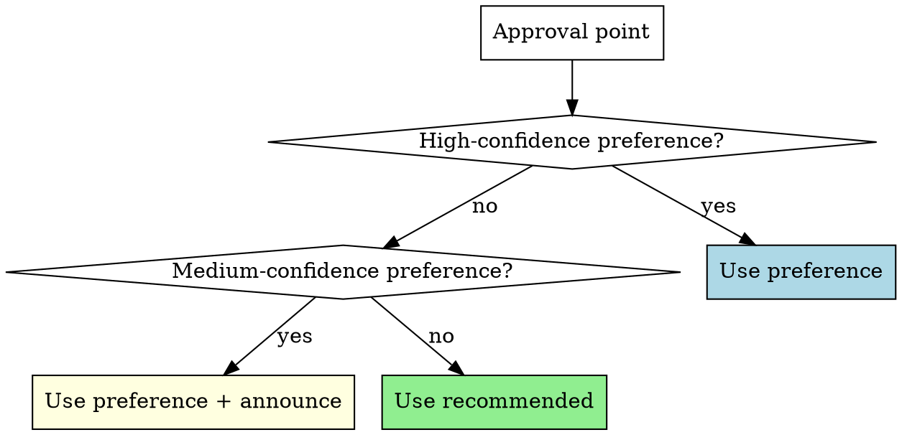
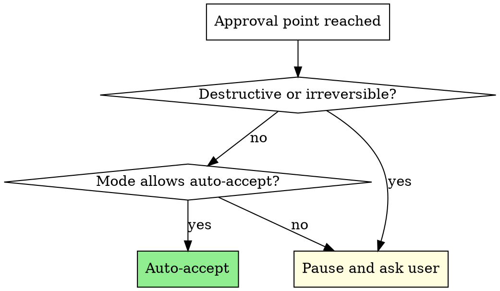

# Autopilot

## Overview

Auto-accept recommended options from any skill without pausing for user approval. Works with superpowers, custom skills, or any workflow that presents choices with recommendations.

## Modes

Invoke with a mode argument:

- `/autopilot` or `/autopilot full` — auto-accept all non-destructive approval points
- `/autopilot partial` — auto-accept design/brainstorming, but pause at execution choices
- `/autopilot off` — disable, revert to normal approval behavior
- `/autopilot learning high` — auto-apply preferences after 1 occurrence
- `/autopilot learning medium` — auto-apply after 3 occurrences (default)
- `/autopilot learning low` — auto-apply after 5 occurrences (conservative)

Mode and learning can be combined: `/autopilot full` then `/autopilot learning high`.

### Mode Behavior

| Approval Type | full | partial | off |
|---|---|---|---|
| Brainstorming approaches | auto | auto | ask |
| Design section approval | auto | auto | ask |
| Execution method choice | auto | ask | ask |
| Batch checkpoints | auto | ask | ask |
| Phase transitions | auto | auto | ask |
| Destructive actions | ask | ask | ask |

## When Active (full or partial)

You MUST automatically proceed with the recommended option at every applicable approval point. Do NOT pause to ask the user. Do NOT present options and wait. Just take the recommended path and keep moving.

## Generic Auto-Accept Pattern

This skill is NOT limited to superpowers. Apply to **any skill** that presents options:

- A skill presents 2+ options with a recommendation → pick the recommendation
- A skill asks for approval to continue → approve and continue
- A skill presents a design/plan for review → approve it
- A skill reaches a checkpoint and pauses → continue

**The rule:** If a skill is waiting for user input and the choice is non-destructive, auto-accept the recommended or default option.

### Superpowers-Specific Points

These are the most common approval points:

| Skill | Approval Point | Auto Action |
|-------|---------------|-------------|
| brainstorming | 2-3 approach options | Pick recommended approach |
| brainstorming | Design section approval | Approve, continue to next |
| brainstorming | Final design approval | Approve, proceed to writing-plans |
| writing-plans | Execution method choice | Pick recommended method (full only) |
| executing-plans | Batch checkpoint | Continue to next batch (full only) |
| systematic-debugging | Phase transitions | Proceed through all phases |

**Announce, don't ask.** Instead of "Which approach do you prefer?", say "Going with approach 2 (recommended) — [one-line reason]" and continue.

## Learning — Adaptive Preferences

Autopilot learns from the user's choices over time. Preferences are stored in `~/.claude/skills/autopilot/preferences.md`.

### When to Record

Record a preference whenever the user **manually chooses** an option — whether autopilot is on or off:

- User picks a non-recommended approach → record it
- User consistently picks the same option at a choice point → record it
- User overrides an auto-accept decision → record the override
- User approves or rejects a destructive action → record it

### Format

Use compact entries in `preferences.md`:

```markdown
## Learned Rules (high confidence — 3+ occurrences)
- finishing-branch → "Push and create PR" (5x)
- writing-plans → "subagent-driven" (3x)
- brainstorming → prefers simplest viable approach (4x)

## Observations (low confidence — tracking)
- 2026-02-26: brainstorming approach — chose simplest over recommended (1x)
```

### Confidence Levels

Thresholds depend on the learning sensitivity setting:

| | learning high | learning medium (default) | learning low |
|---|---|---|---|
| Track only | — | 1-2x | 1-4x |
| Auto-apply + announce | — | 3-4x | 5-6x |
| Auto-apply silently | 1x+ | 5x+ | 7x+ |

- **`learning high`** — trust after first occurrence. Every choice is immediately a learned rule.
- **`learning medium`** — default. Build confidence gradually over 3-5 occurrences.
- **`learning low`** — conservative. Needs 7+ occurrences to auto-apply silently.

### Decision Priority

When autopilot is ON and an approval point is reached:

1. **High-confidence preference** → use it
2. **Medium-confidence preference** → use it, announce source
3. **No preference** → use recommended option, announce "recommended"



### When Autopilot is OFF

Still record choices to `preferences.md` — learning happens regardless of mode.

## Session Log

Track all auto-accepted decisions during the session. When the user asks for a summary or at the end of a session, output:

```
## Autopilot Session Log
- [brainstorming] Picked approach 2 (recommended) — balanced complexity
- [brainstorming] Auto-approved design sections 1-3
- [writing-plans] Picked subagent-driven (your preference, 5x)
- [executing-plans] Auto-continued batches 1-3
- [finishing-branch] PAUSED — asked user about git push → approved
```

Keep this log in memory during the session. Do NOT write it to disk unless the user asks.

## HARD STOP — Pause for These

These apply in ALL modes (full, partial, off). Do NOT auto-accept:

- `git push` to any remote branch
- `git merge` to any branch
- `git reset --hard`, `git checkout .`, or any force operation
- "Discard this work" option in finishing-a-development-branch
- Deleting branches, files, or significant code
- Any action that affects shared/remote state



## Red Flags — These Mean STOP

If you catch yourself thinking any of these, you are about to auto-accept something you should NOT:

| Thought | Action |
|---------|--------|
| "It's just a push to my branch" | STOP. All pushes need approval. |
| "Merging to main is the obvious choice" | STOP. All merges need approval. |
| "Discarding saves time" | STOP. Destructive. Ask first. |
| "Force push will fix it" | STOP. Irreversible. Ask first. |
| "I'll just delete this old branch" | STOP. Deletion needs approval. |
