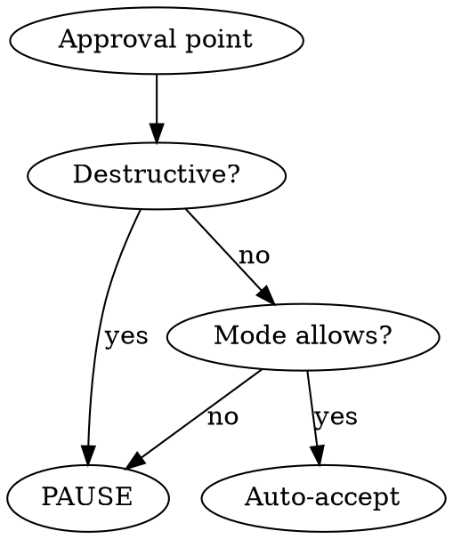

# Autopilot

Auto-accept recommended options from any skill without pausing. Works with superpowers, custom skills, or any workflow with approval points.

## Commands

```
/autopilot              # full mode (recommended)
/autopilot full         # same — auto-accept all non-destructive points
/autopilot partial      # auto-accept design only, pause at execution
/autopilot off          # disable
/autopilot learning <h/m/l>  # set learning sensitivity
/autopilot recommend    # show recommended settings based on usage
/autopilot log          # show session decisions
/autopilot status       # show current mode + learning level
```

## Recommended Setup

> `/autopilot full` + `/autopilot learning high`
>
> Best for experienced users who trust the defaults and want maximum speed. Auto-accepts everything non-destructive, learns your preferences after a single choice.

## Mode Behavior

| Approval Type | full | partial | off |
|---|---|---|---|
| Brainstorming approaches | auto | auto | ask |
| Design approval | auto | auto | ask |
| Execution method | auto | **ask** | ask |
| Batch checkpoints | auto | **ask** | ask |
| Phase transitions | auto | auto | ask |
| Destructive actions | **ask** | **ask** | **ask** |

Mode and learning can be combined: `/autopilot full` then `/autopilot learning high`. **Learning thresholds govern when preferences are recorded and applied; mode governs what gets auto-accepted when no preference exists.** They are independent axes.

## Core Rule

When active, MUST auto-proceed with the recommended option. Do NOT pause, present options, or wait. **Announce, don't ask:** "Going with approach 2 (recommended) — [reason]" and continue.

Applies to **any skill** — not just superpowers:
- Options with recommendation → pick it
- Approval to continue → approve
- Design/plan review → approve
- Checkpoint pause → continue

### When You Must Pause and Ask

In partial mode or at hard stops, when presenting options to the user via `AskUserQuestion`, mark the recommended option with a `markdown` preview panel — do NOT add "(Recommended)" to the label:

```
{
  "label": "Subagent-Driven",
  "description": "Dispatch fresh subagent per task with two-stage review",
  "markdown": "## Recommended\n\nBest for staying in this session with fast iteration.\n\n**Pros:** No context switch, review checkpoints automatic\n**Con:** More subagent invocations"
}
```

The `markdown` field is only visible when the option is focused — it surfaces the rationale without cluttering the label. Use it on the recommended option only.

### Superpowers-Specific Approval Points

| Skill | Approval Point | Auto Action |
|-------|---------------|-------------|
| brainstorming | 2-3 approach options | Pick recommended approach |
| brainstorming | Design section approval | Approve, continue to next |
| brainstorming | Final design approval | Approve, proceed to writing-plans |
| writing-plans | Execution method choice | Pick recommended method (full only) |
| executing-plans | Batch checkpoint | Continue to next batch (full only) |
| systematic-debugging | Phase transitions | Proceed through all phases |

## Learning

Preferences stored in `~/.claude/skills/autopilot/preferences.md`. Records choices whether autopilot is on or off.

### When to Record

Record a preference whenever the user **manually chooses** an option — whether autopilot is on or off:

- User picks a non-recommended approach → record it
- User consistently picks the same option → record it
- User overrides an auto-accept decision → record the override
- User approves or rejects a destructive action → record it

### Sensitivity

| | high | medium (default) | low |
|---|---|---|---|
| Track only | — | 1-2x | 1-4x |
| Auto-apply + announce | — | 3-4x | 5-6x |
| Auto-apply silently | 1x+ | 5x+ | 7x+ |

### Decision Priority

1. High-confidence preference → use silently
2. Medium-confidence preference → use + announce source
3. No preference → use recommended + announce

### Recording Format

```markdown
## Learned Rules
- finishing-branch → "Push and create PR" (5x, high)
- writing-plans → "subagent-driven" (3x, medium)

## Observations
- 2026-02-26: brainstorming → chose simplest over recommended (1x)
```

## `/autopilot recommend`

When invoked, analyze `preferences.md` and current usage to suggest optimal settings:

```
Autopilot Recommendations:
  Mode: full (you rarely override auto-accepted decisions)
  Learning: high (you're consistent — 90% of choices match first occurrence)
  Suggestion: Consider adding git push to feature branches as auto-accept
             (you've approved 8/8 feature branch pushes, rejected 0)
```

**Smart suggestions include:**
- Mode upgrade/downgrade based on override frequency
- Learning level based on choice consistency
- Promoting hard-stop actions to auto-accept if user always approves them (requires explicit user confirmation to add)
- Demoting auto-accept actions to hard-stop if user frequently overrides

## Session Log

Tracked in memory. View with `/autopilot log`:

```
Autopilot Session Log (full, learning: high)
  [brainstorming] approach 2 (recommended)
  [brainstorming] design approved (3 sections)
  [writing-plans] subagent-driven (your preference)
  [executing-plans] batches 1-3 auto-continued
  [finishing-branch] PAUSED — git push → user approved
```

## HARD STOP — Always Pause

Applies in ALL modes. Never auto-accept:

- `git push` / `git merge` / `git reset --hard` / force operations
- "Discard this work" in finishing-branch
- Deleting branches, files, or significant code
- Any action affecting shared/remote state


```dot
digraph {
    "Approval point" -> "Destructive?";
    "Destructive?" -> "PAUSE" [label="yes"];
    "Destructive?" -> "Mode allows?" [label="no"];
    "Mode allows?" -> "Auto-accept" [label="yes"];
    "Mode allows?" -> "PAUSE" [label="no"];
}
```

**Red flags — if you think these, STOP:**

| Thought | Reality |
|---|---|
| "Just a push to my branch" | All pushes need approval |
| "Merge to main is obvious" | All merges need approval |
| "Discarding saves time" | Destructive — ask first |
| "Force push will fix it" | Irreversible — ask first |
